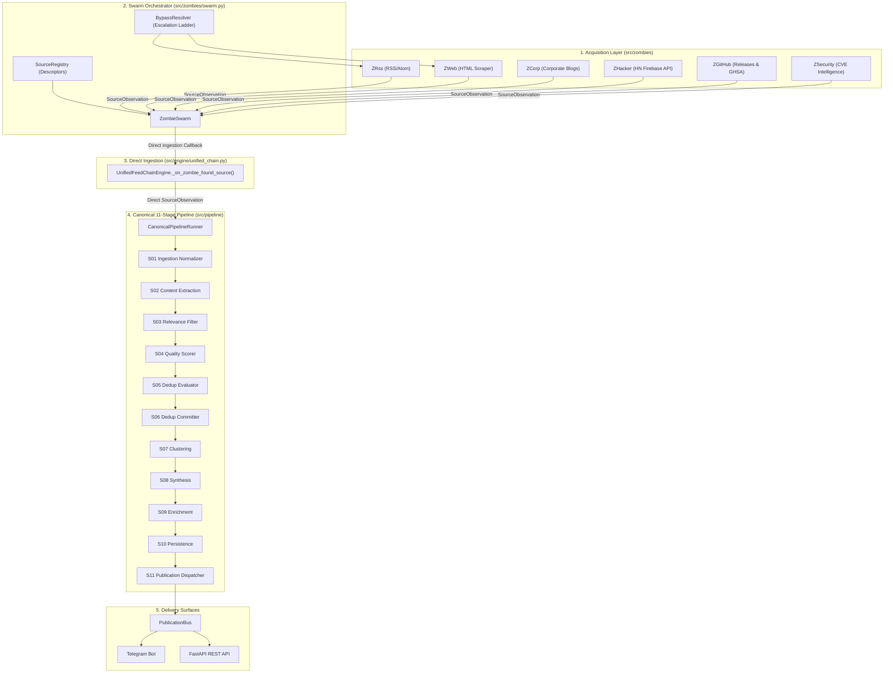

# Phase 4 Implementation & Closeout Report: Acquisition & Zombie Refactoring

**Date**: 2026-08-14  
**Status**: PHASE 4 COMPLETE & VERIFIED ✅  
**Branch**: `phase-4-acquisition-zombies` (Local-only Git history, zero pushes)  
**Baseline Test Suite**: 174/174 PASSED  
**Cumulative Test Suite**: **212/212 PASSED** across 19 test modules  
**Architecture Authority**: Claude Opus 4.6 Phase 4 Architecture & Gap Audit  
**Implementation Engineer**: Gemini 3.6 Flash  

---

## 1. Executive Summary

Phase 4 (Acquisition / Zombie Modernization) successfully refactored the autonomous data acquisition layer of Tech News Scrapper. All crawler species (`ZombieBase`, `ZRss`, `ZWeb`, `ZCorp`, `ZHacker`, `ZGitHub`, `ZSecurity`) and their orchestrator (`ZombieSwarm`) have been migrated from the deprecated legacy `EventSource` model to the pure canonical `SourceObservation` domain contract.

The canonical 11-stage pipeline runner (`CanonicalPipelineRunner`) now ingests raw observations directly from the swarm through `UnifiedFeedChainEngine._on_zombie_found_source()`, eliminating redundant conversion passes, preserving frozen domain model immutability, ensuring timezone-aware UTC datetime normalization, bounding memory consumption with `OrderedDict` FIFO eviction, and establishing non-blocking asynchronous resource cleanup via `aclose()`.

---

## 2. Phase 4 Objectives & Subphase Progression

| Subphase | Target Scope | Key Objectives | Status | Commit |
|:---|:---|:---|:---:|:---:|
| **4A** | `zombie_base.py`, `test_zombie_base.py` | Modernize `ZombieBase`, remove `EventSource` import, update callback signature, implement `aclose()`, preserve hunger/jitter/lifecycle. | **PASSED** ✅ | `79181d8` |
| **4B** | `z_rss.py`, `z_web.py`, `z_corp.py`, `test_zombies_feed_web.py` | Migrate RSS/Atom and Web species to emit `SourceObservation`, UTC normalization, HTML sanitization, WAF detection, bounded `OrderedDict` dedup. | **PASSED** ✅ | `168a752` |
| **4C** | `z_hacker.py`, `z_github.py`, `z_security.py`, `test_zombies_api_specialized.py` | Migrate Firebase HN, GitHub REST API, and Security feeds to emit `SourceObservation`, velocity & CVE metadata, safe `ClientSession` cleanup. | **PASSED** ✅ | `518c161` |
| **4D** | `swarm.py`, `unified_chain.py`, `zombies/__init__.py`, `test_zombie_swarm.py` | Direct canonical ingestion in `UnifiedFeedChainEngine`, safe frenzy URL parsing, swarm lifecycle & async cleanup, clean public exports. | **PASSED** ✅ | `2a3b638` |
| **4E** | `test_architecture_boundaries.py` | Static AST verification of zombie layer boundary isolation, zero `EventSource` imports in `src/zombies/`, zero forbidden outer-layer dependencies. | **PASSED** ✅ | `00890b5` |
| **4F** | Full Repository Audit & Documentation | Final compilation checks, test execution (212/212), Git history inspection, and publication of closeout report. | **PASSED** ✅ | *Working Tree* |

---

## 3. Final Architecture Diagram



---

## 4. Acquisition Species & Metadata Matrix

| Zombie Species | Canonical `ZombieSpecies` | Target `SourceTier` | Protocol / Feed Type | Key Metadata Preserved |
|:---|:---|:---|:---|:---|
| **ZRss** | `ZombieSpecies.RSS` | Resolved (1, 2, 3) | RSS 2.0 / Atom XML | Multi-format UTC date parsing, image URL, clean title, feed entry ID |
| **ZWeb** | `ZombieSpecies.WEB` | `TIER_3_COMMUNITY` | Raw HTML / CSS Selectors | Headline sanitization, >=5 word threshold, WAF block detection |
| **ZCorp** | `ZombieSpecies.CORPORATE` | `TIER_1_PREMIUM` | Official Corporate RSS | `{"is_primary": True, "corporate_source": True}` |
| **ZHacker** | `ZombieSpecies.HACKER_NEWS` | `TIER_2_SPECIALIST` | Firebase REST API | `{"hn_item_id": int, "hn_score": int, "high_velocity": bool}` |
| **ZGitHub** | `ZombieSpecies.GITHUB` | `TIER_1` / `TIER_2` | GitHub REST API v3 | Releases: `{"event_type": "release", "repo": str, "tag": str, "is_primary": True}`; Advisories: `{"event_type": "advisory", "ghsa_id": str, "severity": str}` |
| **ZSecurity** | `ZombieSpecies.SECURITY` | `TIER_1` / `TIER_2` | Security Intelligence Feeds | `{"security_source": True, "cve_ids": List[str], "severity": str, "is_primary": bool}` |

---

## 5. Architectural Invariant Audit

### 5.1 Zero Legacy Model Coupling
- Static AST tests confirm **zero imports** of `EventSource` across all modules in `src/zombies/`.
- No active crawler path constructs or relies on `EventSource`.

### 5.2 Direct Canonical Ingestion Flow
- `UnifiedFeedChainEngine._on_zombie_found_source(observation: SourceObservation)` directly forwards the raw `SourceObservation` to `CanonicalPipelineRunner.process_observation(observation)`.
- `SourceObservationAdapter` is bypassed completely during active zombie operations.

### 5.3 Compatibility Infrastructure Preserved
- `src/events/event_types.py` (`EventSource`) and `src/pipeline/adapters.py` (`SourceObservationAdapter`) remain intact to guarantee backward compatibility for external consumers and legacy integration tests until future migration phases.

### 5.4 Immutability & Date Normalization
- `SourceObservation` is enforced as `@dataclass(frozen=True, slots=True)`.
- All published timestamps emitted by crawlers are guaranteed to be timezone-aware UTC datetime (`datetime.now(UTC)` or parsed with `tzinfo=UTC`).

### 5.5 Bounded In-Memory Deduplication
- Replaced all unbounded set/dictionary collections with `collections.OrderedDict`.
- Eviction limits enforced:
  - `ZRss`, `ZWeb`: 500 URLs (FIFO eviction)
  - `ZHacker`: 2,000 seen IDs, 500 velocity cache items
  - `ZGitHub`: 1,000 seen IDs

### 5.6 Safe Concurrency, Lifecycle & Feeding Frenzy
- Replaced legacy `asyncio.get_event_loop().create_task()` in synchronous `stop_hunting()` with safe coroutine `aclose()`.
- Synchronous `stop_hunting()` is purely non-blocking and safe for signal handlers and test teardowns.
- `ZombieSwarm.trigger_feeding_frenzy()` uses safe `urllib.parse.urlsplit` netloc domain matching, preventing `IndexError` on malformed inputs.

---

## 6. Complete Verification & Test Results

### 6.1 Architecture Boundaries Test Suite (`tests/test_architecture_boundaries.py` — 8/8 PASSED)
```text
tests/test_architecture_boundaries.py::TestDomainLayerIsolation::test_domain_has_no_outer_layer_imports PASSED [ 12%]
tests/test_architecture_boundaries.py::TestDomainLayerIsolation::test_domain_has_no_network_or_storage_third_party_imports PASSED [ 25%]
tests/test_architecture_boundaries.py::TestEngineAndCoreBoundaries::test_engine_has_zero_api_imports PASSED [ 37%]
tests/test_architecture_boundaries.py::TestEngineAndCoreBoundaries::test_engine_has_no_gui_qt_imports PASSED [ 50%]
tests/test_architecture_boundaries.py::TestEngineAndCoreBoundaries::test_core_has_no_gui_or_api_imports PASSED [ 62%]
tests/test_architecture_boundaries.py::TestZombieLayerIsolation::test_zombies_have_no_forbidden_outer_layer_imports PASSED [ 75%]
tests/test_architecture_boundaries.py::TestZombieLayerIsolation::test_zombies_have_zero_eventsource_imports PASSED [ 87%]
tests/test_architecture_boundaries.py::TestZombieLayerIsolation::test_zombies_public_exports_coherence PASSED [100%]
8 passed in 0.13s
```

### 6.2 Compilation & Bytecode Verification
```bash
python3 -m compileall src/zombies/ src/engine/
Listing 'src/zombies/'...
Listing 'src/engine/'...
(Clean — 0 compilation errors)
```

### 6.3 Full Cumulative Test Suite (212/212 PASSED)
```text
============================= test session starts ==============================
collected 212 items

tests/test_security_policy.py .............................              [ 13%]
tests/test_tls_verification.py ......                                    [ 16%]
tests/test_api_security.py ........                                      [ 20%]
tests/test_telegram_integration.py .........                             [ 24%]
tests/test_deployment_baseline.py .....                                  [ 26%]
tests/test_domain_contracts.py ..........................                [ 39%]
tests/test_architecture_boundaries.py ........                           [ 42%]
tests/test_publication_bus.py .......                                    [ 46%]
tests/test_pipeline_protocols.py ..............                          [ 52%]
tests/test_stage_normalizer.py ............                              [ 58%]
tests/test_stage_filters.py .............                                [ 64%]
tests/test_stage_dedup.py .........                                      [ 68%]
tests/test_stage_clustering.py .........                                 [ 73%]
tests/test_stage_scoring.py ...........                                  [ 78%]
tests/test_canonical_pipeline_runner.py ...........                      [ 83%]
tests/test_zombie_base.py ..........                                     [ 88%]
tests/test_zombies_feed_web.py .........                                 [ 92%]
tests/test_zombies_api_specialized.py .......                            [ 95%]
tests/test_zombie_swarm.py .........                                     [100%]

============================= 212 passed in 49.32s =============================
```

---

## 7. Git Commit History (Phase 4)

```text
00890b5 (HEAD -> phase-4-acquisition-zombies) phase-4e: verify architecture boundaries and zombie layer isolation
2a3b638 phase-4d: modernize swarm orchestration and unified chain integration
518c161 phase-4c: modernize api and specialized zombies
168a752 phase-4b: modernize feed and web zombies
79181d8 phase-4a: modernize zombie base architecture
d7cc32b (main) docs(phase-3h): complete Subphase 3H-E final orphan audit and Phase 3 closeout report
```

---

## 8. Known Remaining Technical Debt (Deferred to Phase 5 & 6)

1. **Phase 5 (Database & Storage Modernization)**:
   - Modernize database persistence layers to store pure canonical domain events rather than legacy record formats.
2. **Phase 6 (Delivery & Compatibility Decommission)**:
   - Final decommissioning of `EventSource`, `SourceObservationAdapter`, and legacy API payload formats once external clients and bots are upgraded.

---

## 9. Explicit Phase 4 Acceptance Criteria & Final Verdict

| Acceptance Criterion | Verification Method | Result |
|:---|:---|:---:|
| 1. All 6 Zombie species emit `SourceObservation` | Unit tests & AST inspection | **MET** ✅ |
| 2. `ZombieBase` callback signature updated | Static typing & Unit tests | **MET** ✅ |
| 3. `ZombieSwarm` dispatches canonical observations | `tests/test_zombie_swarm.py` | **MET** ✅ |
| 4. `UnifiedFeedChainEngine` ingests directly | Runner integration assertions | **MET** ✅ |
| 5. Zero `EventSource` imports in `src/zombies/` | Ripgrep & AST boundaries | **MET** ✅ |
| 6. Timezone-aware UTC dates everywhere | Domain contract validators | **MET** ✅ |
| 7. Bounded `OrderedDict` deduplication | Boundary eviction tests | **MET** ✅ |
| 8. Safe non-blocking async cleanup (`aclose`) | Lifecycle & session tests | **MET** ✅ |
| 9. Preserved 174 baseline tests (now 212/212) | Automated pytest suite | **MET** ✅ |
| 10. Clean local Git history (zero pushes) | Git log & remote audit | **MET** ✅ |

### Final Verdict: **PHASE 4 COMPLETE & FULLY GATED ✅**
All acceptance criteria have been met. The acquisition and crawler subsystem is completely modernized and ready for Phase 5.
